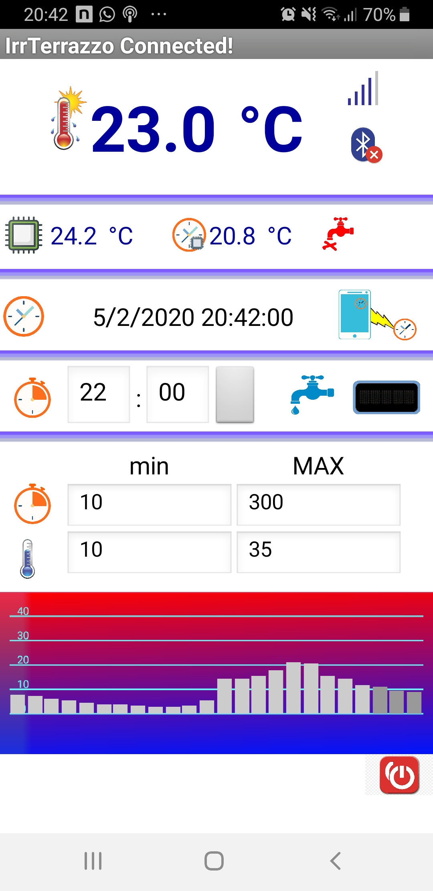

# plant-control
Simple irrigation control for your garden, programmable via BLE serial or companion app

Companion App has been created in MIT App Inventor platform - http://ai2.appinventor.mit.edu/, thanks a lot to the MIT for this great software!

Thanks to the BBC for the micro:bit https://microbit.org/

Thanks to Arduino and all Arduino contributors for all their fantastic the software - https://www.arduino.cc/ (and I can't wait for the first production release of their new PRO IDE ...) 

All the used components can be easily found on ebay, ali, ...

